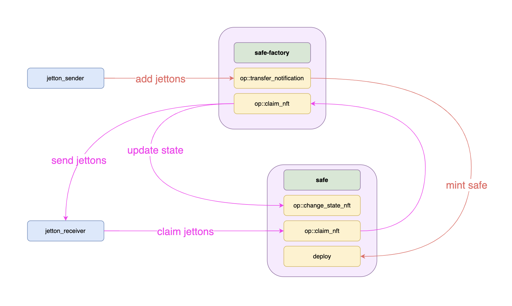
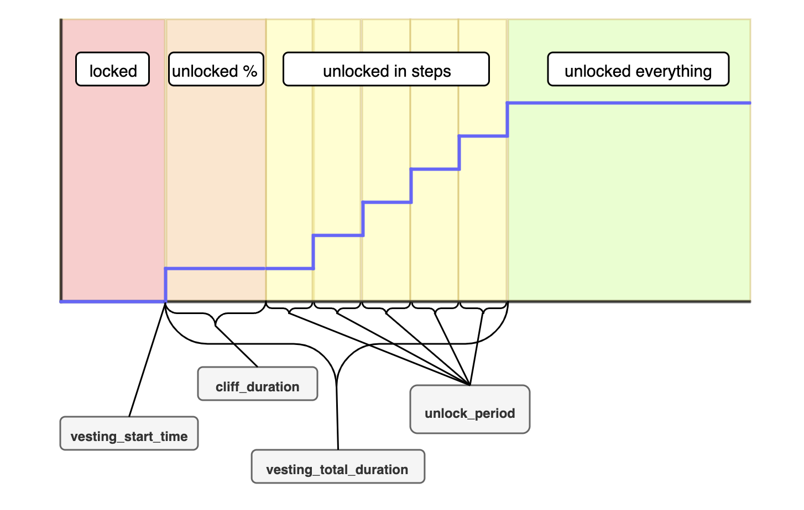

# Vesting Jetton Contract

*This contract allows you to lock a certain amount of any Jettons for a specified time and gradually unlock them according to cliff and vesting.*

## Contracts interaction scheme.

## Jetton unlocking process.

# Parameters

Parameters are unchanged and is set during deployment.

| Parameter                     | Type         | Constraint                                                      | Description |
|-------------------------------|--------------|-----------------------------------------------------------------|-------------|
| `vesting_total_amount`        | `Coins`     |                                                                 | The total amount of locked Jettons. |
| `vesting_start_time`          | `uint32`    |                                             | The UNIX time, the starting point of the vesting period. Until this moment the `vesting_total_amount` is locked, after that it starts to unlock according to other parameters. |
| `vesting_total_duration`      | `uint32`    | `vesting_total_duration > 0, vesting_total_duration mod unlock_period == 0` | Total vesting duration in seconds. |
| `unlock_period`               | `uint32`    | `unlock_period > 0, unlock_period <= vesting_total_duration`    | Unlock period in seconds. |
| `cliff_duration`              | `uint32`    | `cliff_duration >= 0, cliff_duration <= vesting_total_duration, cliff_duration mod unlock_period == 0` | Starting cliff period duration in seconds. |
| `initially_unlocked_percentage` | `uint32`  | `initially_unlocked_percentage >= 0, initially_unlocked_percentage <= 100` | The percentage of `vesting_total_amount` that will be unlocked immediately after `vesting_start_time`. |

## Project structure

-   `contracts` - source code of all the smart contracts of the project and their dependencies.
-   `wrappers` - wrapper classes (implementing `Contract` from ton-core) for the contracts, including any [de]serialization primitives and compilation functions.
-   `tests` - tests for the contracts.
-   `scripts` - scripts used by the project, mainly the deployment scripts.

## How to use

### Build

`npx blueprint build` or `yarn blueprint build`

### Test

`npx blueprint test` or `yarn blueprint test`

### Deploy or run another script

`npx blueprint run` or `yarn blueprint run`

### Add a new contract

`npx blueprint create ContractName` or `yarn blueprint create ContractName`
